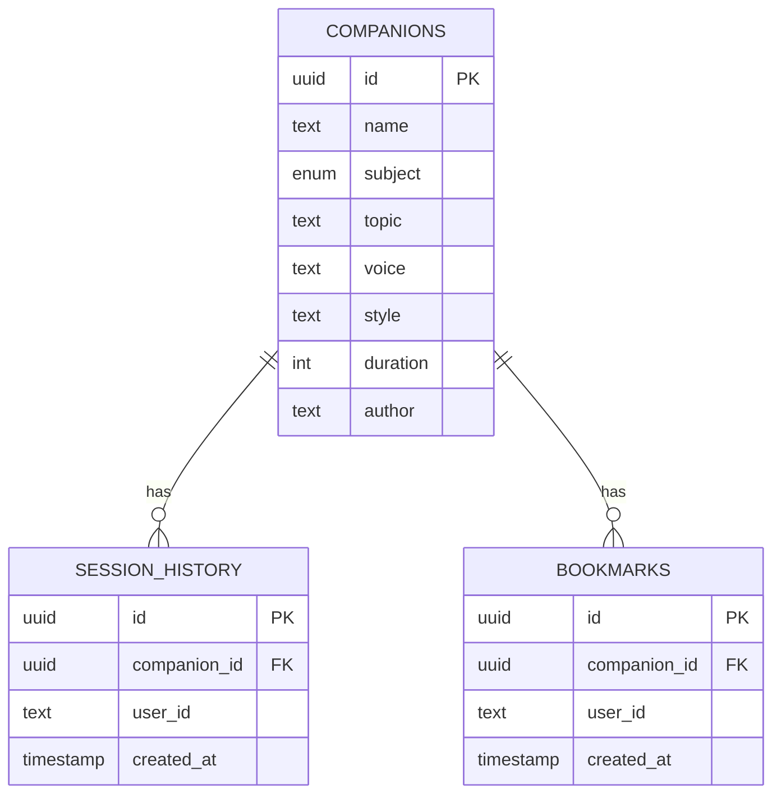

<div align="center">

# 🎓 Converso

### AI-Powered Real-Time Teaching Platform

[](https://nextjs.org/)
[](https://react.dev/)
[](https://www.typescriptlang.org/)
[](https://tailwindcss.com/)

[](https://supabase.com/)
[](https://clerk.com/)
[](https://openai.com/)
[](https://vapi.ai/)

**Create custom AI tutors • Voice-based learning • Real-time interaction**

[Getting Started](#-getting-started) • [Features](#-features) • [Tech Stack](#️-tech-stack) • [Documentation](#-how-it-works)

</div>

---

## 🎯 Overview

> **Converso** transforms education through AI-powered voice companions that deliver personalized tutoring sessions. Learn any subject through natural voice conversations with intelligent AI tutors.

```
🎤 Voice-First Learning  →  🤖 AI-Powered Tutors  →  📊 Track Progress
```

## ✨ Features

<table>
<tr>
<td width="50%">

### 🎓 AI Voice Companions

- 🎤 Real-time voice conversations
- 📚 Math • Science • Language • History • Coding • Economics
- 🎭 Male/Female voices • Casual/Formal styles
- 🧠 Adaptive teaching methods

### 👤 User Management

- 🔐 Clerk authentication
- 📊 Progress dashboards
- 📝 Session history
- ⭐ Bookmark favorites

</td>
<td width="50%">

### 📚 Companion Library

- 🔍 Browse & search AI tutors
- 🎨 Create custom companions
- 🏷️ Filter by subject/topic
- 🎯 Tiered permissions (3/10/unlimited)

### 📊 Analytics

- ✅ Lessons completed
- ⏱️ Time tracking
- 🚀 Learning journey
- 🔄 Recent sessions

</td>
</tr>
</table>

## 🛠️ Tech Stack

<table>
<tr>
<td align="center" width="33%">

### Frontend


Radix UI • React Hook Form
Zod • Lottie React

</td>
<td align="center" width="33%">

### Backend


Server Actions
Row Level Security

</td>
<td align="center" width="33%">

### AI Services


ElevenLabs Voice
Deepgram Transcription
WebSocket Streaming

</td>
</tr>
</table>

## 📁 Project Structure

```
converso-test/
├── app/                          # Next.js app router pages
│   ├── companions/               # Companion-related pages
│   │   ├── page.tsx             # Companion library
│   │   ├── new/page.tsx         # Create new companion
│   │   └── [id]/page.tsx        # Companion session page
│   ├── my-journey/              # User profile and progress
│   ├── subscription/            # Subscription management
│   └── api/                     # API routes
├── components/                   # React components
│   ├── CompanionComponent.tsx   # Main voice interaction component
│   ├── CompanionForm.tsx        # Companion creation form
│   ├── CompanionCard.tsx        # Companion display card
│   ├── CompanionsList.tsx       # List of companions
│   ├── Navbar.tsx               # Navigation bar
│   └── ui/                      # Reusable UI components
├── lib/                         # Utility functions and services
│   ├── actions/                 # Server actions
│   │   └── companion.actions.ts # Companion CRUD operations
│   ├── supabase.ts              # Supabase client setup
│   ├── vapi.sdk.ts              # VAPI AI SDK initialization
│   └── utils.ts                 # Helper functions
├── types/                       # TypeScript type definitions
│   ├── index.d.ts               # Core types
│   └── vapi.d.ts                # VAPI-specific types
└── constants/                   # Application constants
    ├── index.ts                 # Subject colors, voices, etc.
    └── soundwaves.json          # Lottie animation data
```

## 🚀 Getting Started

### Prerequisites

- Node.js 20+
- npm/yarn/pnpm
- Supabase account
- Clerk account
- VAPI AI account
- OpenAI API access
- ElevenLabs API access (for voice synthesis)

### Environment Variables

Create a `.env.local` file in the root directory:

```env
# Clerk Authentication
NEXT_PUBLIC_CLERK_PUBLISHABLE_KEY=your_clerk_publishable_key
CLERK_SECRET_KEY=your_clerk_secret_key
NEXT_PUBLIC_CLERK_SIGN_IN_URL=/sign-in

# Supabase
NEXT_PUBLIC_SUPABASE_URL=your_supabase_url
NEXT_PUBLIC_SUPABASE_ANON_KEY=your_supabase_anon_key

# VAPI AI
NEXT_PUBLIC_VAPI_WEB_TOKEN=your_vapi_web_token

# Sentry (Optional)
SENTRY_AUTH_TOKEN=your_sentry_auth_token
```

### Installation

1. Clone the repository:

```bash
git clone https://github.com/ParaPixel-DigiServices/converso.git
cd converso
```

2. Install dependencies:

```bash
npm install
```

3. Set up Supabase database with the following tables:

   - `companions`: Stores AI companion configurations
   - `session_history`: Tracks completed learning sessions
   - `bookmarks`: User bookmarks for companions

4. Run the development server:

```bash
npm run dev
```

5. Open [http://localhost:3000](http://localhost:3000) in your browser

## 📖 How It Works

### Creating a Companion

1. Navigate to `/companions/new`
2. Fill in the companion form:
   - Name: Give your AI tutor a name
   - Subject: Select from available subjects
   - Topic: Specify what you want to learn
   - Voice: Choose male or female
   - Style: Select casual or formal teaching style
   - Duration: Set session length (minutes)
3. Submit to create your personalized AI tutor

### Starting a Learning Session

1. Browse the companion library or select from your created companions
2. Click on a companion card to start a session
3. Click "Start Session" to initiate voice conversation
4. The AI tutor will:
   - Introduce the topic
   - Break down concepts into manageable parts
   - Check your understanding periodically
   - Adapt based on your responses
5. Use the microphone toggle to mute/unmute yourself
6. View real-time transcripts of the conversation
7. End the session when complete

### 🔄 Voice Interaction Flow

```text
🎤 User Speech
    ↓
🔊 Deepgram (Transcription)
    ↓
📝 Text Transcript
    ↓
🤖 GPT-4 (AI Processing)
    ↓
💬 Response Text
    ↓
🎙️ ElevenLabs (Voice Synthesis)
    ↓
🔉 AI Voice Output
    ↓
👂 User Hears Response
    ↓
💾 Save to History
```

**Real-time WebSocket Connection • Natural Voice Conversation**

## 🎨 Key Components

| Component              | Purpose               | Features                                                                     |
| ---------------------- | --------------------- | ---------------------------------------------------------------------------- |
| **CompanionComponent** | Voice interaction hub | 🔴 Call states • 🎤 Mic controls • 📝 Live transcripts • 🎬 Animations       |
| **CompanionForm**      | Companion creator     | 📋 Subject/topic • 🎭 Voice/style • ⏱️ Duration • ✅ Validation              |
| **Server Actions**     | Backend operations    | 🔧 CRUD operations • 📚 Library queries • 📊 History tracking • ⭐ Bookmarks |

## 📊 Database Schema



## 🔐 Authentication & Authorization

| Feature               | Technology  | Details                            |
| --------------------- | ----------- | ---------------------------------- |
| 🔑 Authentication     | Clerk       | User sessions & sign-in/sign-up    |
| 🛡️ Protected Routes   | Middleware  | Auth-required pages                |
| 📦 Subscription Tiers | Clerk Plans | Free (3) • Standard (10) • Pro (∞) |

## 🎯 Future Enhancements

| Category          | Features                                                    |
| ----------------- | ----------------------------------------------------------- |
| 📈 **Analytics**  | Progress insights • Learning patterns • Performance metrics |
| 🎓 **Assessment** | Quizzes • Tests • Certifications                            |
| 🌍 **Expansion**  | Multi-language • Mobile app • Group sessions                |
| 🎮 **Engagement** | Achievements • Badges • Learning paths • Gamification       |

## 📝 Scripts

```bash
npm run dev          # Start development server with Turbopack
npm run build        # Build for production
npm run start        # Start production server
npm run lint         # Run ESLint
```

---

<div align="center">

## 📝 License & Contact

**Developed by [ParaPixel DigiServices](https://github.com/ParaPixel-DigiServices)**

🤝 Contributions Welcome • 📧 Contact for Support

---


</div>
